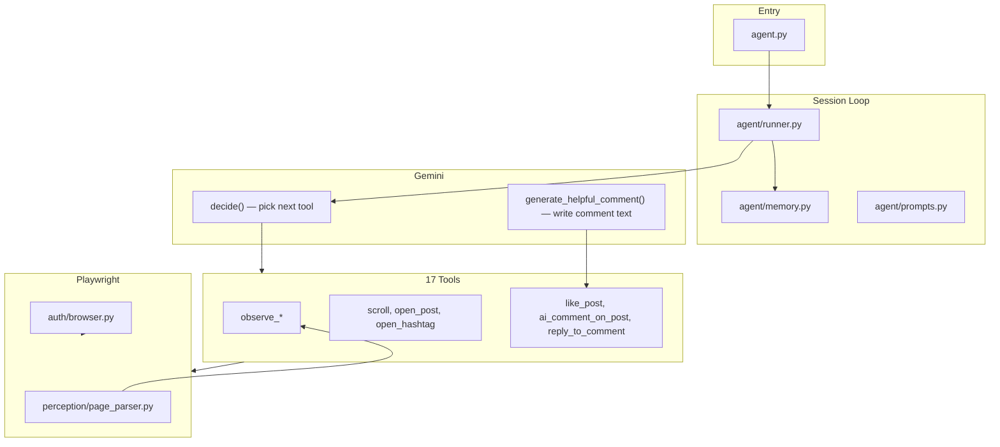
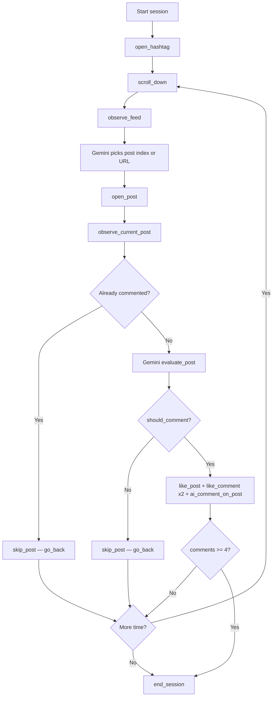

# Instagram Gemini Agent — Detailed Build Plan

## Current system (how it works today)



**Run command:** `python agent.py`  
**Config:** [`.env`](.env) (live credentials + `GEMINI_API_KEY`, real-estate mission, limits)  
**Verification reports:** `debug_output/tool_checks/<timestamp>/report.html`

---

## Part 1 — What is DONE (detailed inventory)

### 1.1 Project structure

| Area | Path | Purpose |
|------|------|---------|
| Entry | [`agent.py`](agent.py) | Starts Gemini timed session |
| Legacy bot | [`main.py`](main.py) | Old scripted hashtag bot |
| Auth | [`authenticate.py`](authenticate.py) | Browser login, saves session |
| Package | [`instagram_bot/`](instagram_bot) | All agent logic |
| Manual tests | [`scripts/test_tools.py`](scripts/test_tools.py) | 12-step tool verification (no API key) |
| Session data | [`data/browser_state.json`](data/browser_state.json) | Saved Instagram cookies |
| Debug | [`debug_output/tool_checks/`](debug_output/tool_checks) | Per-step screenshots + JSON reports |

### 1.2 Authentication (Facebook-linked account)

Built in [`instagram_bot/auth/browser.py`](instagram_bot/auth/browser.py):

- Loads Playwright storage state from `data/browser_state.json`
- Handles **Continue** screen (force click)
- Handles **Meta password popup** (`input[name="pass"]`)
- Dismisses **notifications** ("Not Now"), **cookie banners**, **repost modal**
- `instagrapi` password login fails for this account — browser path is the primary auth method

### 1.3 Configuration

Built in [`instagram_bot/config/settings.py`](instagram_bot/config/settings.py) + [`.env`](.env):

| Setting | Current value | Role |
|---------|---------------|------|
| `HASHTAG_TO_SEARCH` | `realestate` | Starting hashtag |
| `SEARCH_HASHTAGS` | 4 real-estate tags | Rotation list |
| `GEMINI_MODEL` | `gemini-2.5-flash` | Decision + comment writing |
| `MAX_COMMENTS_PER_SESSION` | `4` | Hard cap |
| `MAX_LIKES_PER_SESSION` | `12` | Hard cap |
| `SESSION_MINUTES` | `25` | Session timer |
| `AGENT_MISSION` / `AGENT_PERSONA` | Real-estate expert | Prompt context |

API key is read from `.env` file directly (not `.env.example`).

### 1.4 All 17 tools (Phase 1 + extras)

Registry: [`instagram_bot/tools/registry.py`](instagram_bot/tools/registry.py)

**Perception (read page)**
- `observe_page_state` — URL + page type (home/explore/post)
- `observe_feed` — list visible post URLs on grid
- `observe_current_post` — author, caption, top comments
- `observe_comments` — comment list with username + text

**Navigation (move like a user)**
- `scroll_down` — human wheel scroll (400–900px + delay)
- `open_hashtag` — go to `#tag` explore page
- `open_post` — open by grid index or URL
- `go_home` / `go_back` — navigate away / close modal

**Actions (engage)**
- `comment_on_post` — manual text comment
- `ai_comment_on_post` — Gemini reads caption → writes comment → posts
- `like_post` — like open post
- `like_comment` — like comment by index
- `reply_to_comment` — reply to visible comment
- `dismiss_popups` — clear blockers

**Session**
- `wait` — human pause
- `end_session` — stop loop

### 1.5 Page parser (DOM → JSON)

Built in [`instagram_bot/perception/page_parser.py`](instagram_bot/perception/page_parser.py):

- `detect_page_type()` from URL
- `parse_feed_posts()` — dedupe post/reel links from grid
- `_extract_post_via_js()` — **primary caption extraction** via `div[role="dialog"]` / `h1` / `span[dir="auto"]` / `og:description` fallback
- `parse_comments()` — JS-first comment extraction from `ul` items

**Verified:** Caption extraction works (~900 chars on real-estate listing post). Author field still often empty (username embedded in caption text instead).

### 1.6 Gemini integration

Built in [`instagram_bot/agent/gemini_client.py`](instagram_bot/agent/gemini_client.py):

- **`decide(prompt)`** — function calling; Gemini picks 1+ tools per loop step
- **`generate_helpful_comment(caption, author, comments)`** — separate LLM call for comment text (1–3 sentences, specific, no spam)
- Conversation history maintained across session via `_history`

### 1.7 Session runner

Built in [`instagram_bot/agent/runner.py`](instagram_bot/agent/runner.py):

- Timed loop until `SESSION_MINUTES` expires
- Hard guards before executing tools:
  - Skip comment if `comments_count >= MAX_COMMENTS_PER_SESSION`
  - Skip comment if `memory.has_commented(page.url)`
  - Skip likes if at cap or already liked
- Screenshot verification via [`instagram_bot/utils/verify.py`](instagram_bot/utils/verify.py)
- Engagement hints injected when agent is on a post but hasn't engaged yet

### 1.8 Session memory (in-session dedup)

Built in [`instagram_bot/agent/memory.py`](instagram_bot/agent/memory.py):

- Tracks `commented_posts[]`, `liked_items[]`, counts for comments/likes/replies
- `has_commented(post_url)` — blocks duplicate comments **within same session**
- Also written in [`instagram_bot/tools/actions.py`](instagram_bot/tools/actions.py) `comment_on_post()` → `ctx.memory["commented_posts"]`

### 1.9 Manual tool verification

[`scripts/test_tools.py`](scripts/test_tools.py) — **12/12 PASS** on prior run:

login → dismiss → observe → open_hashtag → scroll → open_post → observe post/comments → comment → reply → go_home

Does **not** yet test: `ai_comment_on_post`, `like_post`, `like_comment`.

### 1.10 Live agent run results (real estate mission)

| Run | Result | Comments | Likes | Notes |
|-----|--------|----------|-------|-------|
| `20260714_110143` | **Success** | **4/4** | 4 | First full real-estate mission |
| `20260714_111356` | **Success** | **3/4** | 4 | Hit 80-step cap before 4th AI comment |
| Both | 0 tool failures | Gemini comments specific to captions | Posts liked | Reports in `debug_output/tool_checks/` |

**Example AI comment (from run):**  
*"That 'no HOA, no city taxes' paired with the full renovation in Lincolnton's Eastridge subdivision is a huge selling point..."*

---

## Part 2 — What is NOT done / known gaps

### 2.1 Critical gaps (blocking your ideal workflow)

| Gap | Evidence | Impact |
|-----|----------|--------|
| **No AI "should I comment?" decision** | Agent opens posts sequentially; prompt says "engage on every post" | Comments on weak/irrelevant posts; wastes steps |
| **Inefficient browsing** | Latest run: many `open_post → go_back` cycles without engaging | Misses 4th comment; burns 80 steps |
| **Comment liking broken** | `comments_liked: []` on every `ai_comment_on_post` | User mission "like different comments" not fulfilled |
| **Comment parsing empty** | `observe_comments` returns `count: 0` on posts with 240+ comments | Gemini can't see existing comments; like_comment fails |
| **80-step hard cap** | [`runner.py`](instagram_bot/agent/runner.py) `if step > 80: break` | Session ends mid-engagement |
| **No cross-session memory** | `SessionMemory` resets each run | Could re-comment same post next day |
| **Author field empty** | Parser returns caption with username baked in | Minor; comment quality still OK |

### 2.2 Phase 1 plan items marked complete but not fully exercised

- `reply_to_comment` — built + tested on `#pythoncoding`, **not used** in real-estate runs
- `like_post` / `like_comment` — added early (were Phase 2 in original plan); like_comment unreliable
- AI post selection — **not in original Phase 1**; you now want this as core behavior

### 2.3 Phase 2+ (not started)

DMs, follow/unfollow, notifications, save/bookmark, profiles, reels/stories, content creation — all deferred per original plan.

---

## Part 3 — Target behavior (your requested workflow)

This is the **intelligent browsing loop** the agent should follow:



### 3.1 AI post selection rules (Gemini thinking)

Before commenting, Gemini must evaluate each opened post using **caption + author + visible comments** and return:

```json
{
  "should_comment": true,
  "confidence": 0.85,
  "reason": "Listing post with specific renovation details — can add value about no-HOA markets",
  "skip_reason": null
}
```

**Comment when (examples):**
- Real estate listing, investment tip, market analysis, agent advice, property tour
- Caption has enough detail to write a **specific** helpful comment
- Post is not pure spam, giveaway, or unrelated content

**Skip when (examples):**
- Not real-estate related (motivation quotes, unrelated lifestyle)
- Caption too vague ("link in bio" only, no property context)
- Already commented (memory check — **code enforced, not prompt-only**)
- Promotional/spam where a comment would look bot-like
- User's own post or duplicate content already seen this session

**Browse behavior:**
- Scroll feed naturally (2–4 scrolls between posts)
- Open post → read full caption (`observe_current_post`) → **think** → act or skip
- Do **not** comment on every opened post — selective engagement is the goal
- Rotate hashtags from `SEARCH_HASHTAGS` when feed gets stale

### 3.2 Duplicate-post protection (must be bulletproof)

**Three layers:**

1. **Runner guard** (exists): block `ai_comment_on_post` if URL in `memory.commented_posts`
2. **Normalize URLs** (new): strip query params, trailing slashes — `https://instagram.com/p/ABC/` === `.../p/ABC`
3. **Persistent store** (new): `data/commented_posts.json` — load at session start, append on success, survive restarts

Memory summary sent to Gemini each step must include:
```json
{
  "commented_urls": ["https://www.instagram.com/p/DXeU5dDkeXe/", "..."],
  "comments_remaining": 2
}
```

---

## Part 4 — Fixes to implement (super detailed)

### Fix A — New Gemini method: `evaluate_post_for_comment()`

**File:** [`instagram_bot/agent/gemini_client.py`](instagram_bot/agent/gemini_client.py)

Add method separate from tool-calling loop:

```python
def evaluate_post_for_comment(
    self, caption, author, comments, commented_urls, mission
) -> dict:
    # Returns: should_comment (bool), reason (str), confidence (float)
```

Prompt includes:
- Persona + mission from `.env`
- Full caption (up to 900 chars)
- List of already-commented URLs
- Decision criteria (Section 3.1)
- Output: strict JSON only

Temperature: **0.3** (more consistent decisions than comment writing at 0.85).

### Fix B — New tool: `evaluate_current_post`

**Files:** [`registry.py`](instagram_bot/tools/registry.py), [`tools/actions.py`](instagram_bot/tools/actions.py) or [`tools/perception.py`](instagram_bot/tools/perception.py)

Tool flow:
1. Call `parse_current_post(page)`
2. Check `has_commented(normalized_url)` → return `{already_commented: true, should_comment: false}` immediately (no API call)
3. Else call `gemini.evaluate_post_for_comment(...)`
4. Return structured result to agent history

Gemini `decide()` can then call `evaluate_current_post` before `ai_comment_on_post`.

### Fix C — New tool: `skip_post`

**Purpose:** Explicit "I read this, decided not to comment" action.

- Calls `go_back()` internally
- Records URL in `memory.skipped_posts[]` (avoid re-opening same post same session)
- Returns `{skipped: true, reason: "..."}`

This teaches Gemini that skipping is a valid, complete action — reduces open/back loops.

### Fix D — Runner: goal-based exit (replace step cap)

**File:** [`instagram_bot/agent/runner.py`](instagram_bot/agent/runner.py)

Changes:
- Remove or raise `step > 80` cap
- **Primary exit:** `memory.comments_count >= MAX_COMMENTS_PER_SESSION` → auto `end_session`
- **Secondary exit:** `SESSION_MINUTES` timer
- **Safety cap:** `step > 120` only as emergency brake

Also inject into prompt each step:
```
commented_urls: [...]
skipped_urls: [...]
comments_done: 2/4
```

### Fix E — Persistent commented-post store

**New file:** `instagram_bot/agent/persistent_memory.py`

- Path: `data/commented_posts.json`
- Format: `{ "urls": ["..."], "sessions": [{ "date", "url", "comment_snippet" }] }`
- Load in `run_agent_session()` start
- Save after each successful `ai_comment_on_post`
- Merge with in-session `SessionMemory.commented_posts`

### Fix F — Comment parsing + like_comment reliability

**File:** [`page_parser.py`](instagram_bot/perception/page_parser.py)

Improvements:
1. Scroll comment panel before parse (same as `like_comment` does)
2. JS selector: find comment rows by "Reply" button siblings
3. Extract clean username from `href="/username/"` and comment text without "Like Reply" noise
4. Return `like_button_index` per comment for direct liking

**File:** [`actions.py`](instagram_bot/tools/actions.py) `like_comment()`

- Use parsed comment list indices instead of generic `svg[aria-label="Like"]` (first match may be **post** like, not comment)
- Exclude post-level Like button: only hearts inside `ul` comment list
- Verify like toggled (aria-label becomes "Unlike" or class change)

### Fix G — Author extraction cleanup

**File:** [`page_parser.py`](instagram_bot/perception/page_parser.py)

- Prefer `header a[href^="/"]` href parsing (already partially done)
- Strip "Verified", timestamps from caption start if author missing
- Pass clean `@author` to Gemini for better comments

### Fix H — Prompt rewrite for selective engagement

**File:** [`instagram_bot/agent/prompts.py`](instagram_bot/agent/prompts.py)

Replace "MANDATORY engage every post" with:

```
WORKFLOW:
1. scroll_down → observe_feed
2. open_post (pick interesting grid index)
3. observe_current_post
4. evaluate_current_post — READ the decision
5. If should_comment=true AND not already commented:
     like_post → like_comment(0) → like_comment(2) → ai_comment_on_post
   Else:
     skip_post
6. Repeat until 4 comments OR session time ends
7. end_session

NEVER comment without evaluate_current_post first.
NEVER comment on a URL in commented_urls.
```

Remove conflicting "URGENT engage before go_back" hint in runner — replace with "URGENT: call evaluate_current_post first".

### Fix I — Optional: structured browse state machine

**File:** [`instagram_bot/agent/runner.py`](instagram_bot/agent/runner.py)

Lightweight state to reduce Gemini wandering:

| State | Allowed tools |
|-------|---------------|
| `browsing` | scroll_down, observe_feed, open_hashtag, open_post, wait |
| `reading` | observe_current_post, evaluate_current_post |
| `engaging` | like_post, like_comment, ai_comment_on_post |
| `skipping` | skip_post, go_back |
| `done` | end_session |

Runner sets state based on last tool result; filters invalid tool calls before execution. Gemini still decides **which post** and **whether to comment** — state machine only prevents tool chaos.

### Fix J — Update test_tools.py

**File:** [`scripts/test_tools.py`](scripts/test_tools.py)

Add steps 13–16:
- `like_post`
- `observe_comments` (assert count > 0 on busy post)
- `like_comment` index 0
- `ai_comment_on_post` (requires `GEMINI_API_KEY` — optional flag `--with-gemini`)

Target: **16/16 PASS** before live agent run.

### Fix K — Feed preview captions (optional enhancement)

**File:** [`page_parser.py`](instagram_bot/perception/page_parser.py)

Enhance `parse_feed_posts()` to include `caption_snippet` from grid overlay alt-text or aria-label when available — lets Gemini pre-filter before opening post (saves steps).

---

## Part 5 — Implementation order

| Step | Task | Files | Depends on |
|------|------|-------|------------|
| 1 | URL normalization + persistent memory | `persistent_memory.py`, `memory.py`, `runner.py` | — |
| 2 | `evaluate_post_for_comment()` in Gemini | `gemini_client.py` | — |
| 3 | `evaluate_current_post` + `skip_post` tools | `registry.py`, `perception.py` or `actions.py` | Step 2 |
| 4 | Fix comment parsing + like_comment | `page_parser.py`, `actions.py` | — |
| 5 | Rewrite prompts + runner hints | `prompts.py`, `runner.py` | Step 3 |
| 6 | Goal-based exit + optional state machine | `runner.py` | Step 5 |
| 7 | Update test_tools.py | `scripts/test_tools.py` | Steps 3–4 |
| 8 | Full verification run | `python agent.py` | All above |

**Estimated scope:** ~6–8 files changed, 1 new file, no new dependencies.

---

## Part 6 — Verification checklist (definition of done)

After fixes, a successful run must show:

- [ ] Agent scrolls hashtag feed naturally (not stuck on index 0)
- [ ] For each candidate post: `observe_current_post` → `evaluate_current_post` logged in report
- [ ] At least 1 post **skipped** with reason (proves selective thinking)
- [ ] **4/4 AI comments** posted without hitting step cap
- [ ] **Zero** comments on URLs in `commented_urls` (including re-open attempts)
- [ ] `comments_liked` shows `[0, 2]` or similar on at least 2 posts
- [ ] `data/commented_posts.json` updated with 4 new URLs
- [ ] Report: `debug_output/tool_checks/<timestamp>/report.html` — 0 failures
- [ ] Re-running agent same day skips all 4 previously commented posts

---

## Part 7 — Phase 2 roadmap (after Part 4–6 complete)

Only start after you say **continue** on Phase 1.5 fixes:

| Feature | Tools to build |
|---------|----------------|
| Direct messages | `read_inbox`, `open_thread`, `send_dm`, `reply_dm` |
| Social graph | `follow_user`, `unfollow_user`, `open_profile` |
| Notifications | `read_notifications`, `dismiss_notification` |
| Bookmarks | `save_post` |
| Home feed | `scroll_home_feed`, `observe_home_feed` |
| Reels/Stories | `open_reel`, `watch_reel`, `view_story` |

Phase 3 (content creation, repost, profile editing) — later approval only.

---

## Part 8 — Risk notes

- Automated Instagram engagement may violate ToS; caps and human delays reduce but do not eliminate risk
- Gemini API costs: ~2 calls per post (evaluate + comment) × 4 posts = ~8 LLM calls per session plus ~40–80 decide() calls
- Instagram DOM changes can break parsers — screenshot reports are the debug safety net
